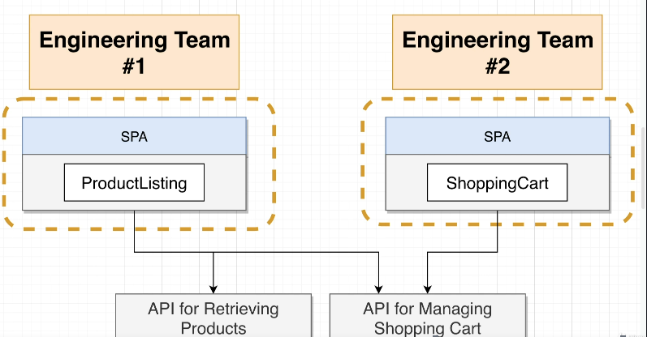
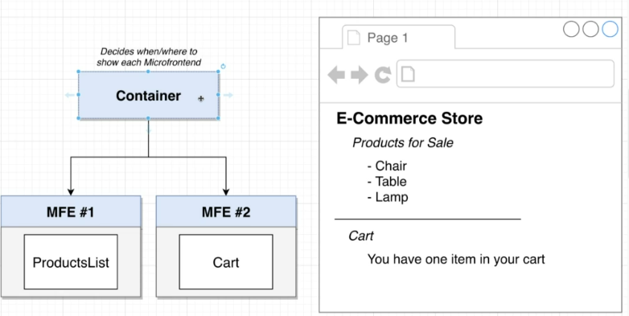
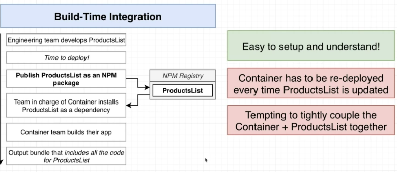
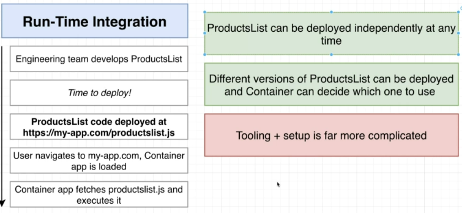
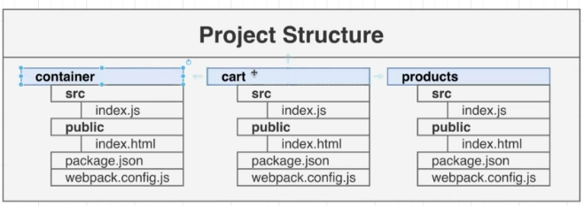
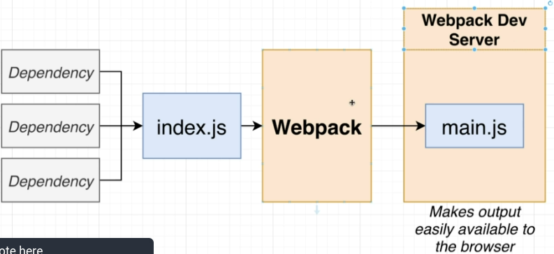

# Microfrontends with React: A Complete Developers Guide

## Overview

- Microfrontends split a monolithis single page application (SPA) up into independent ones with their own codebase
- each smaller app is responsible for a distict feature of the product
- communication happens over APIs (instead of a applicatoin state):

- Advantages
  - no need to stick to one framework
  - teams can work and deploy independently
  - less complexity, other parts aren't easily broken by making changes in another

- A container holds the microfrontends to decide when and where to show the microfrontends (*integration*)

- main categories solutions for integration:
  - build time integration:_**before** container gets loaded in the browser, it gets access to microfronteds source code)
  - run time integration (client side): **after** container gets loaded in the browser, it gets access to microfronteds source code)
  - Server integration: While sending down JS to load up container, server decides which MF to include

## Course focus and project overview

Focus of the course is run-time integration using Webpack Module Federation

- hardest to set up and understand
- most flexible and performant
- needs good understanding of webpack

Example project structure:

- for now, no framework
- must be able to run in isolation
- must be able to be run in container app

## Webpack overview

Minimal viable setup (version numbers only for this project follow along):

`npm install webpack@5.4.0 webpack-cli@4.5.0 webpack-dev-server@3.11.0 faker@5.1.0 html-webpack-plugin@5.1.0`

- put index.js (entry point) in src folder

Add webpack.config.js with content

    module.exports = {
      mode: 'developlment',
    };

Edit scripts section in package.json:

  "scripts": {
    "start": "webpack"
  },

-> running `npm run start`  will now create a diest folder with a monolithic JS file (`main.js` or  `bundle.js` containing all dependencies that were included in the index.js

- reduces files the browser has to load

Webpack dev server makes build available in browser; to enable it, add the following to the webpack-config.js:

    devServer: {
      port: 8081
    }

and change the package.json script to `"start": "webpack serve"`

To make it executable in an html page in the browser, add an html file *without* including the js file. The name of the generated files can change, so we make webpack figure out where to put it using `html-webpack-plugin`, which checks the output of webpack and automatically adds script tags to the specified html file.

- Create an `index.html` in a newly created `public` folder, just put in basic html structure
- add the plugin and html file location to `webpack.config.js`, which now should look like this:

    
      const HtmlWebpackPlugin = require('html-webpack-plugin');

      module.exports = {
        mode: 'development',
        devServer: {
          port: 8081
        },

        plugins: [
          new HtmlWebpackPlugin( {
            template: './public/index.html'
          })
        ]
      };

- when changes in the code occur, webpack automatically rebuilds the dist js, the html includes and reloads the page in the browser

